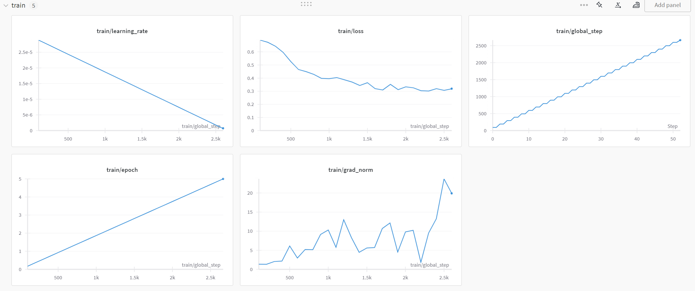
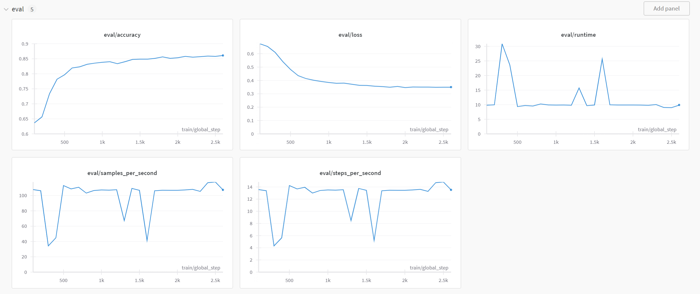

# 🧪 Toxicity Classifier

A fine-tuned Transformer model for detecting toxic news headlines, embedded in an interactive Streamlit app.

🔗 [Live App](https://toxicity-classifier.streamlit.app)

## 🧠 Overview

This project fine-tunes the **Tiny BERT Transformer** to classify the **toxicity** of news headlines. The model was fine-tuned on a custom dataset and embedded into a Streamlit application to allow real-time testing by users.

## 🛠 Tech Stack

| Component     | Technology                     |
|---------------|---------------------------------|
| Logging       | Weights & Biases               |
| Frontend      | Streamlit                      |
| Language      | Python                         |

## 🚀 Getting Started

### 1. Clone the Repository

```bash
git clone https://github.com/xhemalkodragjini/Toxicity-Classifier.git
cd Toxicity-Classifier
```

### 2. Install Dependencies

```bash
pip install -r requirements.txt
```

### 3. Run the Streamlit App

```bash
streamlit run streamlit.py
```

## 📊 Model Training
To train the model from scratch:

```bash
python train.py
```

Training and evaluation logs are recorded with Weights & Biases, including accuracy and loss metrics.


## 🧪 Results

### 🔍 Training Metrics


### 📈 Evaluation Metrics


